# Ad-hoc Consumer Goods Analysis for AtliQ-Hardwares
SQL Ad-hoc Analysis Project for AtliQ Hardwares using MySQL

🎥 Watch Video Explanation : https://youtu.be/VYzl8dWwld4

## Problem Statement
AtliQ Hardwares is a computer hardware manufacturing company that sells products globally through various channels like Amazon, Croma, and Best Buy. AtliQ Hardwares,relied completely on Excel to manage its growing business. As sales and revenue increased, their Excel files became larger and harder to handle — until one day, their key business planning file crashed beyond recovery.

To fix this, AtliQ built a proper MySQL database That’s when they brought in a data analytics team to make the company truly data-informed by solving ad-hoc business problems with SQL. The Product Owner often requests data insights and business reports to support decision-making and improve operational efficiency.

Currently, the data team receives multiple ad-hoc analysis requests from stakeholders to help them understand sales trends, market performance, product demand, and forecast accuracy.
The goal of this project is to create a centralized SQL-based solution to quickly respond to these business questions using views, joins, and stored procedures.

## Objective
The main objective of this project is to:

- AtliQ Hardware is one of the major computer hardware manufacturers in India, with a strong presence in other nations.​
- Nevertheless, the management did note that they do not have sufficient insights to make prompt, wise, and data-informed judgments.​
- So,they plan to expand the data analytics team by adding junior data analysts.​
- To assess candidates, Data analytics director, Tony Sharma plans to conduct a SQL challenge to evaluate both tech and soft skills.​
- The company seeks insights for 10 ad hoc requests.

## Datasets Used
This project uses multiple tables from the AtliQ Hardwares database (gdb023) to perform ad-hoc business analysis and reporting.

## 📊 Dataset Description

| Dataset Name                 | Description                                                                           |
|------------------------------|---------------------------------------------------------------------------------------|
| dim_customer                 | Contains customer details such as customer name, market, region, and customer type.   |
| dim_product                  | Product-related information like product name, variant, division, and category.       |
| fact_sales_monthly           | Monthly sales performance data including sold quantity, product, customer, and date.  |
| fact_gross_price             | Contains product-level gross price details used for revenue calculations.             |
| fact_manufacturing_cost      | Manufacturing cost details for each product.                                          |
| fact_pre_invoice_deductions  | Pre-invoice deduction data like discounts and offers.                                 |

## Dataset Preview

(Database tables from gdb023)

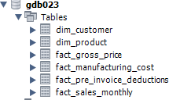

## Ad Hoc Request 1

Provide the list of markets in which customer "Atliq Exclusive" operates its
business in the APAC region.

### SQL Query Used

🔗 [View SQL Query](Queries/Request_1.sql)

### 📊 Output Preview

## Ad Hoc Request 2

What is the percentage of unique product increase in 2021 vs. 2020? The final output contains these fields,
unique_products_2020
unique_products_2021
percentage_chg

### SQL Query Used

🔗 [View SQL Query](Queries/Request_2.sql)

### 📊 Output Preview

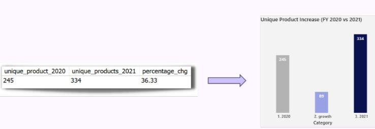

## Ad Hoc Request 3

Provide a report with all the unique product counts for each segment and
sort them in descending order of product counts. The final output contains 2 fields,
segment
product_count

### SQL Query Used

🔗 [View SQL Query](Queries/Request_3.sql)

### 📊 Output Preview

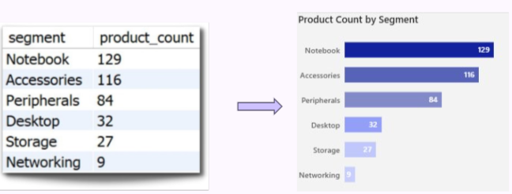

## Ad Hoc Request 4

Follow-up: Which segment had the most increase in unique products in 2021 vs 2020? The final output contains these fields, 
segment
product_count_2020
product_count_2021 
difference

### SQL Query Used

🔗 [View SQL Query](Queries/Request_4.sql)

### 📊 Output Preview

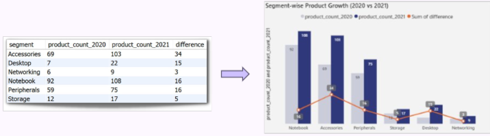

## Ad Hoc Request 5

Get the products that have the highest and lowest manufacturing costs. 
The final output should contain these fields, 
product_code
product 
product manufacturing_cost

### SQL Query Used

🔗 [View SQL Query](Queries/Request_5.sql)

### 📊 Output Preview

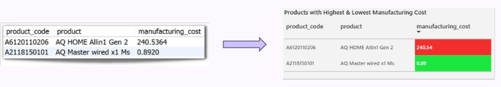

## Ad Hoc Request 6

Generate a report which contains the top 5 customers who received 
an average high pre_invoice_discount_pct for the fiscal year 2021 and in the Indian market. 
The final output contains these fields, 
customer_code 
customer 
average_discount_percentage

### SQL Query Used

🔗 [View SQL Query](Queries/Request_6.sql)

### 📊 Output Preview

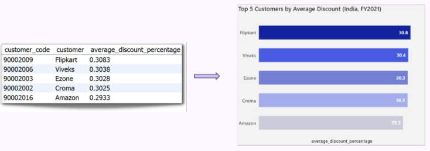

## Ad Hoc Request 7

Get the complete report of the Gross sales amount for the customer “Atliq Exclusive” for each month . 
This analysis helps to get an idea of low and high-performing months and take strategic decisions. 
The final report contains these columns: 
Month 
Year 
Gross sales Amount

### SQL Query Used

🔗 [View SQL Query](Queries/Request_7.sql)

### 📊 Output Preview

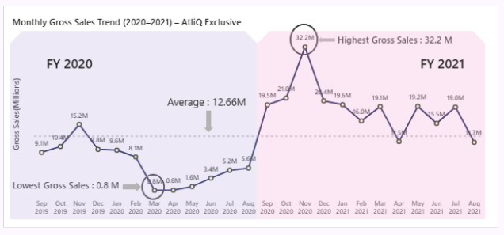

## Ad Hoc Request 8

In which quarter of 2020, got the maximum total_sold_quantity? 
The final output contains these fields sorted by the 
total_sold_quantity, Quarter total_sold_quantity

### SQL Query Used

🔗 [View SQL Query](Queries/Request_8.sql)

### 📊 Output Preview

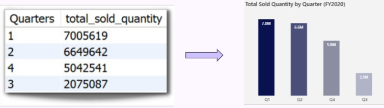

## Ad Hoc Request 9

Which channel helped to bring more gross sales in the fiscal year 2021 and the percentage of contribution? 
The final output contains these fields, 
channel 
gross_sales_mln 
percentage

### SQL Query Used

🔗 [View SQL Query](Queries/Request_9.sql)

### 📊 Output Preview

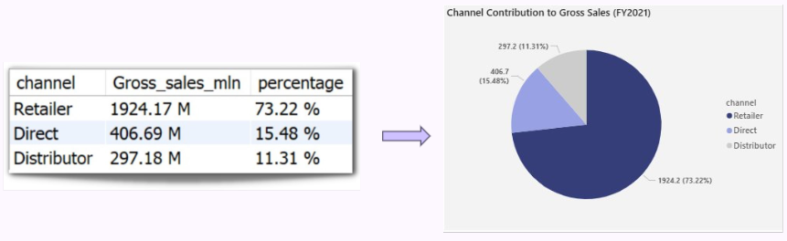

## Ad Hoc Request 10
Get the Top 3 products in each division that have a high total_sold_quantity in the fiscal_year 2021? 
    The final output contains these fields, 
    division 
    product_code

### SQL Query Used

🔗 [View SQL Query](Queries/Request_10.sql)

### 📊 Output Preview

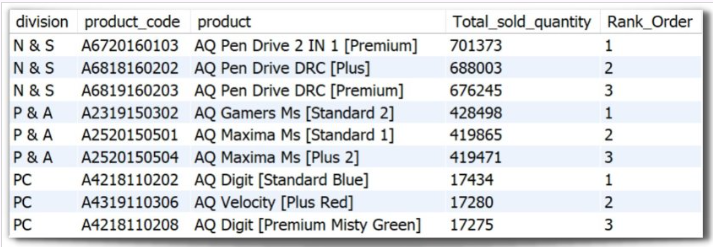

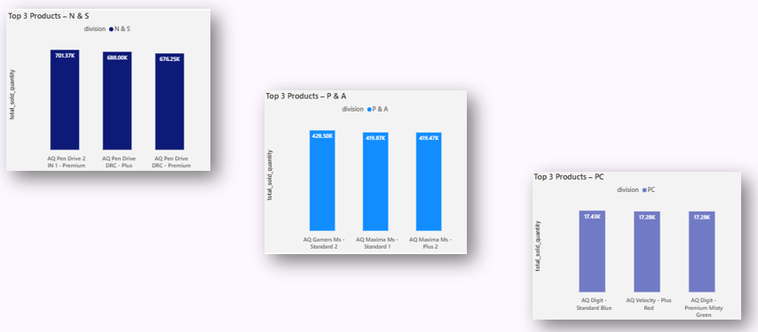

🏁 Conclusion
Through this SQL project, I explored a series of real-world ad-hoc business requests and delivered insights that a product owner or analyst would typically need.

💡 Key Learnings
This project helped me strengthen my ability to:

🧩 Write clean, modular SQL queries for analytical needs
🔗 Use joins, subqueries, CTEs, window function, group by, order by
📊 Translate business questions into data-driven insights
📈 Final Takeaway
This project represents how a data analyst would handle, analyze, and present business data using SQL in a real-world environment.

✅ This concludes the Ad Hoc Consumer Analysis Project for AtliQ Hardwares.
